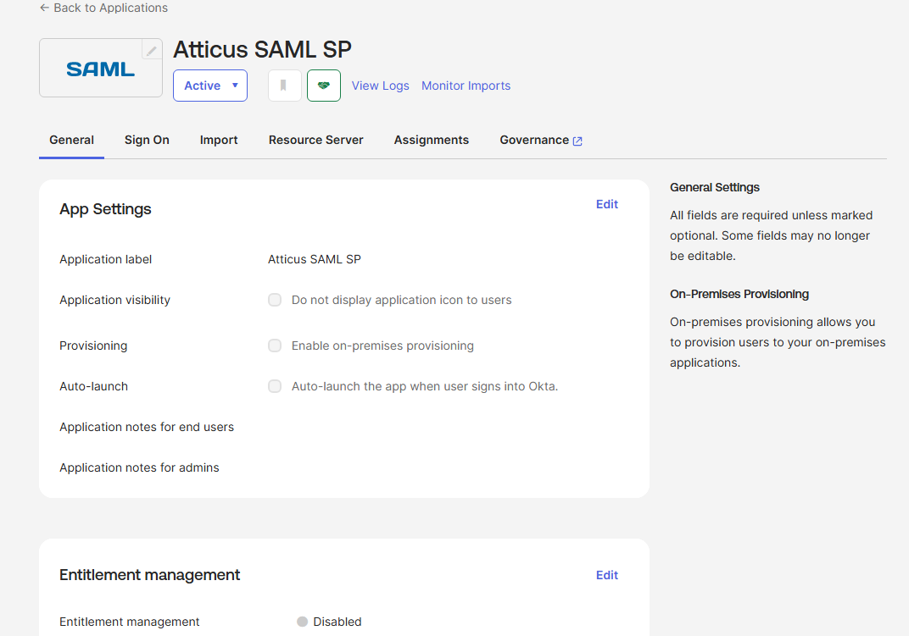
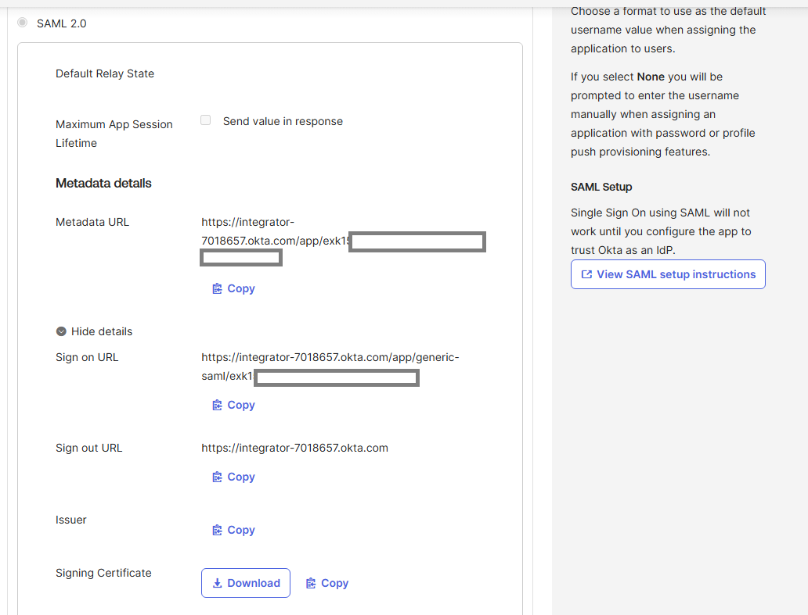
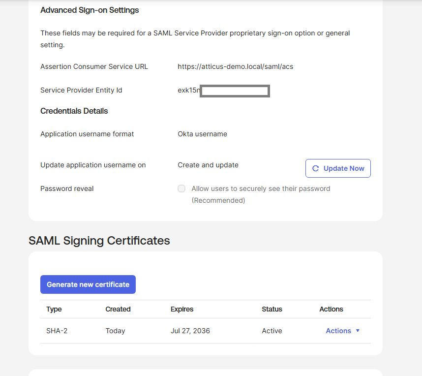
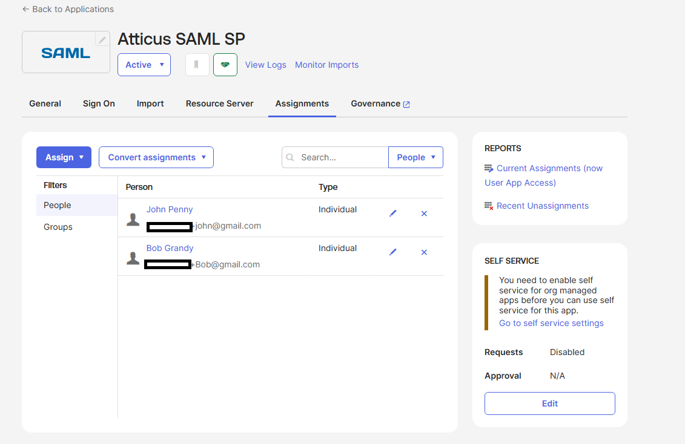
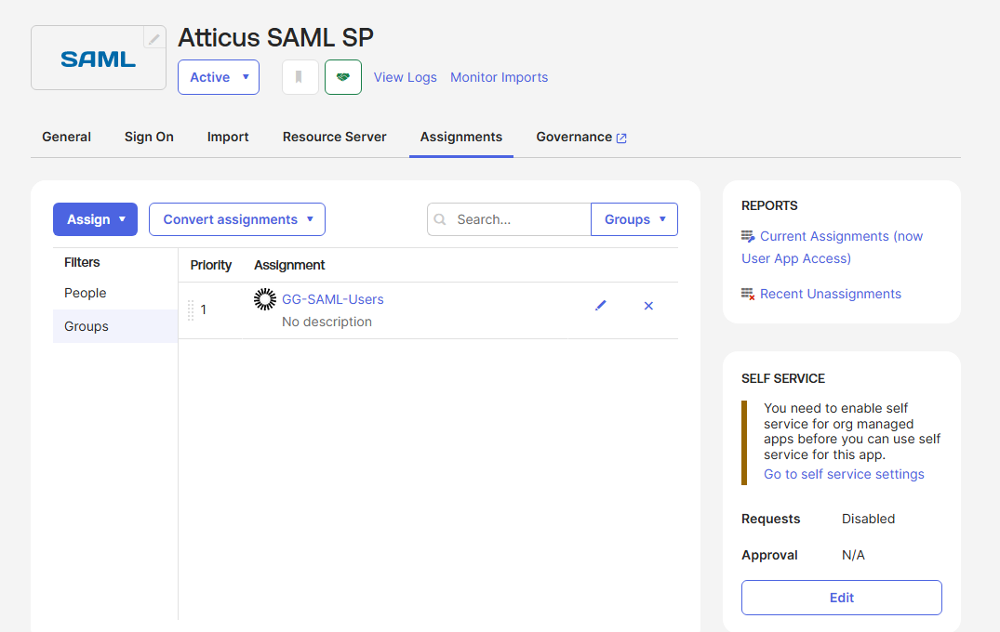
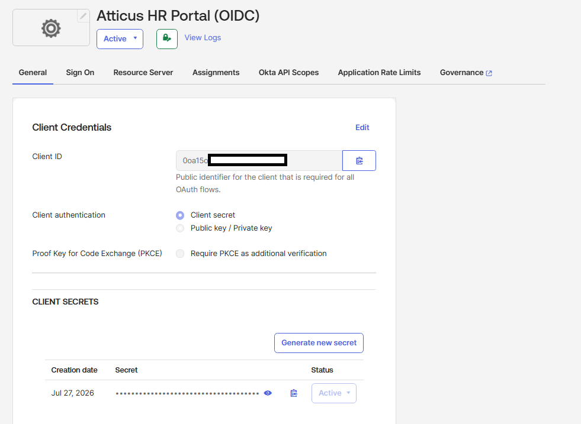
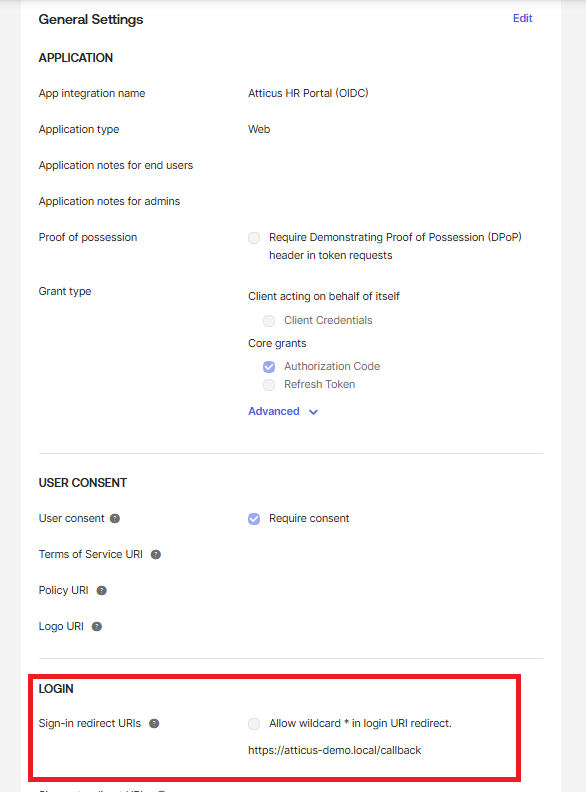
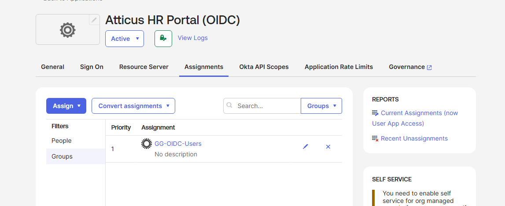

# Okta Identity Federation: SAML 2.0 & OpenID Connect (OIDC)

> Designed and configured enterprise Single Sign-On (SSO) using both SAML 2.0 and OpenID Connect (OIDC) in Okta for a fictional organization. This project demonstrates identity federation concepts, application onboarding, user and group assignments, metadata management, certificate configuration, and modern authentication protocols commonly used in enterprise Identity and Access Management (IAM).

---

## Project Overview

Organizations rarely authenticate users directly inside every application they use. Instead, they centralize authentication through an Identity Provider (IdP) such as Okta. This enables users to authenticate once and securely access multiple applications using industry-standard federation protocols.

This project simulates that enterprise environment by configuring Okta as the Identity Provider for two different authentication protocols:

- SAML 2.0
- OpenID Connect (OIDC)

The fictional company **Atticus Corporation** is used throughout the project to represent an organization onboarding internally developed applications into Okta.

---

## Objectives

This project demonstrates how to:

- Configure a custom SAML 2.0 Service Provider application
- Configure an OpenID Connect (OIDC) Web Application
- Generate and manage Identity Provider metadata
- Configure SAML signing certificates
- Configure OAuth 2.0/OIDC client credentials
- Assign users and security groups to applications
- Understand the authentication flow of SAML and OIDC
- Compare traditional enterprise federation (SAML) with modern authentication (OIDC)

---

# Environment

## Identity Provider

- Okta Integrator Free Plan

## Fictional Organization

**Atticus Corporation**

## Test Users

- John Penny
- Bob Grandy

## Security Groups

- GG-SAML-Users
- GG-OIDC-Users

---

# Identity Federation Architecture

```
                        Atticus Corporation

                +-----------------------------+
                |        Okta (IdP)           |
                | Identity Provider           |
                +-------------+---------------+
                              |
                 Authenticates Employees
                              |
         +--------------------+--------------------+
         |                                         |
         |                                         |
         ▼                                         ▼
+-------------------------+          +----------------------------+
| SAML Service Provider   |          | OIDC Web Application       |
| Atticus HR Portal       |          | Atticus HR Portal          |
+-------------------------+          +----------------------------+
```

---

# SAML 2.0 Configuration

A custom **SAML 2.0 Service Provider (SP)** application was configured in Okta to represent an internally developed HR application for the fictional organization **Atticus Corporation**.

The objective was to establish the trust relationship between **Okta (Identity Provider)** and the **Atticus HR Portal (Service Provider)**, allowing authenticated users to access enterprise applications through Single Sign-On (SSO).

---

## Application Configuration

The custom SAML application was created in Okta and configured as a Service Provider.

Key configuration included:

- Assertion Consumer Service (ACS) URL
- Service Provider Entity ID
- Identity Provider Metadata
- SAML Signing Certificate
- User assignments
- Group assignments



---

## Assertion Consumer Service (ACS)

The **Assertion Consumer Service (ACS)** endpoint is where the Service Provider receives the signed SAML Response after a user successfully authenticates with Okta.

For this demonstration, the following placeholder endpoint was configured:

```text
https://atticus-demo.local/saml/acs
```

This endpoint represents an internally developed application. In a production deployment, this URL would belong to the application and would validate the incoming SAML assertion before granting access.

---

## Service Provider Entity ID

Each Service Provider requires a unique identifier so the Identity Provider knows exactly which application is requesting authentication.

A unique Entity ID was configured during the application setup to establish trust between the Service Provider and Okta.

---

## Metadata & Trust Establishment

Once the SAML application was configured, Okta automatically generated Identity Provider metadata including:

- Metadata URL
- Sign-On URL
- Issuer
- Signing Certificate

These values are normally shared with the Service Provider administrator so the application can establish trust with Okta.



---

## Signing Certificate

Okta generated a SHA-2 signing certificate used to digitally sign SAML assertions.

This certificate allows the Service Provider to verify:

- the assertion originated from the trusted Identity Provider,
- the assertion has not been modified,
- the authentication response is authentic.



---

## User & Group Assignments

Application access was controlled through both individual user assignments and security groups.

### Assigned Users

- John Penny
- Bob Grandy



### Assigned Groups

- GG-SAML-Users
- GG-OIDC-Users

Assigning access through groups reflects common enterprise IAM practices by simplifying permission management and reducing administrative overhead.



---

# OpenID Connect (OIDC) Configuration

A custom **OpenID Connect (OIDC)** Web Application was configured in Okta to demonstrate modern identity federation using the OAuth 2.0 Authorization Code Flow.

Unlike SAML, which exchanges XML-based assertions between an Identity Provider and a Service Provider, OpenID Connect authenticates users by issuing JSON Web Tokens (JWTs), making it the preferred protocol for modern web and mobile applications.

The objective of this configuration was to establish Okta as the Identity Provider for the fictional **Atticus HR Portal**, allowing trusted applications to authenticate users through standardized OAuth 2.0 and OpenID Connect workflows.


---

## Application Configuration

A custom **Web Application** was created in Okta using the OpenID Connect sign-on method.

Key configuration included:

- Authorization Code Grant
- Redirect URI
- Client ID
- Client Secret
- ID Token Configuration
- Automatic Signing Key Rotation
- Authentication Policy
- Token Claims
- User Assignments
- Group Assignments



---

## Authorization Code Flow

The application was configured to use the **Authorization Code Grant**, the most commonly recommended OAuth 2.0 flow for confidential web applications.

In this flow:

1. The user requests access to the application.
2. The application redirects the user to Okta for authentication.
3. Okta authenticates the user.
4. Okta returns an authorization code to the application.
5. The application exchanges the authorization code for an ID Token (and, when applicable, an Access Token).

Using the Authorization Code Flow ensures that tokens are issued securely without exposing user credentials to the client application.

---

## Redirect URI

The application was configured with the following redirect URI:

```text
https://atticus-demo.local/callback
```

The Redirect URI represents the endpoint where Okta sends the authorization response after a successful authentication.

For this project, a placeholder endpoint was intentionally used to represent an internally developed web application. In a production environment, this endpoint would process the authorization code, validate the response, and complete the authentication process.



---

## Client Credentials

Okta automatically generated a **Client ID** and **Client Secret** for the application.

These credentials uniquely identify the client application during OAuth 2.0 authentication.

- **Client ID** identifies the application requesting authentication.
- **Client Secret** authenticates the application when exchanging an authorization code for tokens.

The Client Secret should always be treated as sensitive information and must never be committed to source control or exposed publicly.

---

## ID Token & Token Configuration

OpenID Connect authenticates users by issuing an **ID Token**, which is a digitally signed JSON Web Token (JWT) containing claims about the authenticated user.

This project configured:

- OpenID Connect ID Token
- Dynamic Issuer
- Audience (Client ID)
- Automatic Signing Credential Rotation
- Token Claims

Automatic signing key rotation improves security by periodically replacing signing keys while maintaining trust between Okta and client applications.

---

## Authentication Policy

The application was configured to use an Okta authentication policy requiring **two-factor authentication (2FA)**.

Applying authentication policies at the application level enables organizations to enforce different security requirements depending on the sensitivity of each application.

---

## User & Group Assignments

Application access was managed through Okta user and group assignments.

The application was assigned to:

### Users

- John Penny
- Bob Grandy

### Groups

- GG-OIDC-Users

Managing access through groups rather than assigning permissions individually is a common enterprise IAM practice that simplifies administration and improves scalability.



---

# SAML vs OpenID Connect

| Feature | SAML 2.0 | OpenID Connect |
|----------|----------|----------------|
| Primary Purpose | Authentication | Authentication built on OAuth 2.0 |
| Data Format | XML | JSON (JWT) |
| Primary Token | SAML Assertion | ID Token |
| Protocol Base | SAML | OAuth 2.0 |
| Common Use Case | Enterprise SaaS | Modern Web & Mobile Applications |
| Mobile Friendly | Limited | Excellent |
| Browser Support | Excellent | Excellent |
| Complexity | Higher | Lower |
| Preferred for New Applications | Rarely | Yes |

---

# Authentication Flow

## SAML 2.0

```
User
   │
   ▼
Service Provider
   │
Redirect
   ▼
Okta
   │
Authenticates User
   │
Signed SAML Assertion
   ▼
Service Provider
```

---

## OpenID Connect

```
User
   │
   ▼
Client Application
   │
Authorization Request
   ▼
Okta
   │
Authentication
   │
ID Token + Access Token
   ▼
Client Application
```

---

# Security Features Demonstrated

- Identity Federation
- SAML Signing Certificates
- Metadata Generation
- OAuth Client Credentials
- Redirect URI Validation
- User Assignment
- Group-Based Access Control
- Automatic Signing Key Rotation
- Authentication Policies

---

# Security Considerations

This project demonstrates several security concepts commonly used in enterprise IAM environments:

- Identity Provider trust relationships
- Digital signing certificates
- OAuth client authentication
- Secure redirect URI configuration
- Principle of Least Privilege through user and group assignments
- Identity federation using open standards

Sensitive information such as client secrets should never be published in production environments. Any secrets shown during development should be regenerated or redacted before public release.

---

# Project Limitations

This project focuses on configuring identity federation within Okta rather than deploying a live Service Provider.

Placeholder endpoints (`atticus-demo.local`) were intentionally used to represent internally developed applications.

As a result:

- No live Service Provider was deployed
- No production SAML Assertion was consumed
- No production OIDC callback endpoint was implemented

The objective of this project is to demonstrate configuration, identity federation concepts, and enterprise IAM workflows rather than application development.

---

# Technologies Used

- Okta
- SAML 2.0
- OpenID Connect (OIDC)
- OAuth 2.0
- JWT
- XML
- Identity Federation
- Single Sign-On (SSO)

## Key Takeaways

This project demonstrates practical experience configuring enterprise identity federation using both SAML 2.0 and OpenID Connect in Okta. It showcases application onboarding, authentication protocol configuration, certificate and metadata management, user and group assignments, and the foundational concepts required to support modern Single Sign-On solutions within an enterprise IAM environment.